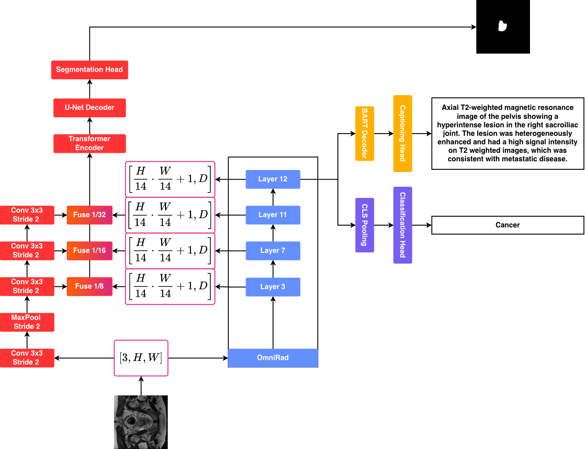

<div align="center">

# 🏥 OmniRad

**A Unified Framework for Medical Image Analysis**

*Classification • Dense Prediction (Segmentation) • Captioning*

</div>


## 🔍 Overview

**OmniRad** is a comprehensive framework for medical image analysis that supports three main tasks:

| Task | Description | Backbone Support |
|------|-------------|------------------|
| **Classification** | Multi-class medical image classification with LoRA support | ViT, DINOv2, DINOv3, CLIP, RadioDino |
| **Dense Prediction** | Medical image segmentation using HybridEncoder (DEIMv2-based) | ViT, DINOv2, DINOv3, RadioDino |
| **Captioning** | Radiology report generation with vision-language models | ViT + BART |

> 🤗 **Pre-trained models are available on HuggingFace**: Check out our [model collection](https://huggingface.co/collections/Snarcy/omnirad) for pre-trained vision backbones.

---

## 🏗️ Architecture

<div align="center">

</div>

The OmniRad architecture leverages:
- **Backbone**: Pre-trained Vision Transformers (ViT) with optional freezing
- **STA (Spatial Token Aggregation)**: Multi-scale feature extraction from ViT layers
- **HybridEncoder**: DEIMv2-style encoder for dense prediction tasks
- **Task-specific Heads**: Classification head, Segmentation decoder, or BART decoder for captioning

---

## 📦 Installation

```bash
# Clone the repository
git clone https://github.com/unica-visual-intelligence-lab/OmniRad.git
cd OmniRad

# Create virtual environment
python -m venv venv
source venv/bin/activate  # Linux/Mac
# or
.\venv\Scripts\activate  # Windows

# Install dependencies from requirements.txt
pip install -r requirements.txt
```

**Requirements include:**
- Core ML frameworks: PyTorch, torchvision, transformers
- Vision models: timm, accelerate
- Medical imaging: medsegbench, segmentation-models-pytorch
- Utilities: PEFT (LoRA), datasets, scikit-learn, tqdm, PyYAML
- Training tools: tensorboard, jiwer, evaluate

---

## 🚀 Training

### 1. Classification

The classification module supports fine-tuning pre-trained models on medical imaging datasets with optional LoRA adapters.

#### Single Model Training

```bash
cd code/classification

python train.py \
    --model "hf_hub:Snarcy/RadioDino-s16" \
    --dataset_path_train /path/to/train \
    --dataset_path_val /path/to/val \
    --dataset_path_test /path/to/test \
    --output_path ./outputs \
```

#### With LoRA Adapters (Parameter-Efficient Fine-Tuning)

```bash
python train.py \
    --model "hf_hub:Snarcy/RadioDino-s16" \
    --dataset_path_train /path/to/train \
    --dataset_path_val /path/to/val \
    --dataset_path_test /path/to/test \
    --output_path ./outputs \
    --use_lora \
```


#### Batch Training (Multiple Models/Datasets)

Edit `launch_finetuning.py` to configure your experiments:


Then run:
```bash
python launch_finetuning.py
```

### 2. Dense Prediction (Segmentation)

The dense prediction module is based on **DEIMv2** architecture, using a HybridEncoder with STA (Spatial Token Aggregation) for medical image segmentation.

#### Training with Base Models

```bash
cd code/dense

python tools/train_segmentation.py -c ./configs/segmentation/medseg_base_models.yml
```

#### Training with Small Models

```bash
python tools/train_segmentation.py -c ./configs/segmentation/medseg_small_models.yml
```

#### Custom Configuration

You can override config values via command line:

```bash
python tools/train_segmentation.py \
    -c ./configs/segmentation/medseg_base_models.yml \
    --output-dir ./custom_outputs \
    --use-amp
```


#### Segmentation Config Variants

| Config | Hidden Dim | Model Size | Use Case |
|--------|-----------|------------|----------|
| `medseg_base_models.yml` | 768 | Base (~86M) | Best performance |
| `medseg_small_models.yml` | 384 | Small (~22M) | Resource-constrained |

---

### 3. Captioning

The captioning module generates radiology reports using a vision-language architecture with BART decoder.

#### Training

Edit paths in `code/captioning/train.py`:

Then run:

```bash
cd code/captioning
python train.py
```


## 🙏 Acknowledgements

This project builds upon several excellent works:

- **[DEIMv2](https://github.com/Intellindust-AI-Lab/DEIMv2)** - Real-Time Object Detection framework used as base for dense prediction
- **[timm](https://github.com/huggingface/pytorch-image-models)** - PyTorch Image Models library
- **[HuggingFace Transformers](https://github.com/huggingface/transformers)** - BART models for captioning
- **[PEFT](https://github.com/huggingface/peft)** - Parameter-Efficient Fine-Tuning (LoRA)

---

## 📄 License

This project is licensed under the Apache 2.0 License - see the [LICENSE](LICENSE) file for details.

---

<div align="center">

**Made with ❤️ by [UNICA Visual Intelligence Lab](https://github.com/unica-visual-intelligence-lab)**

</div>
